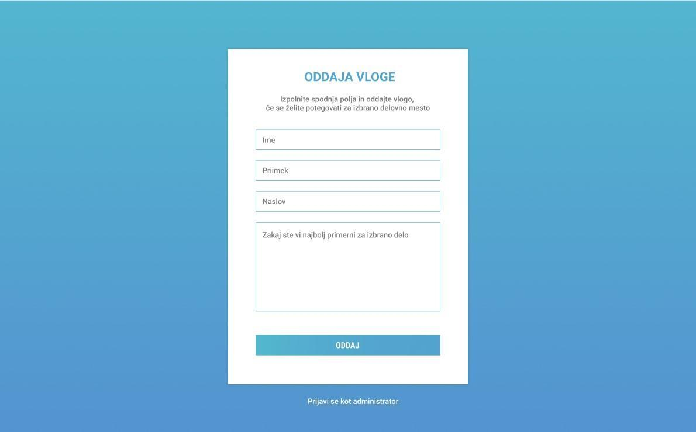
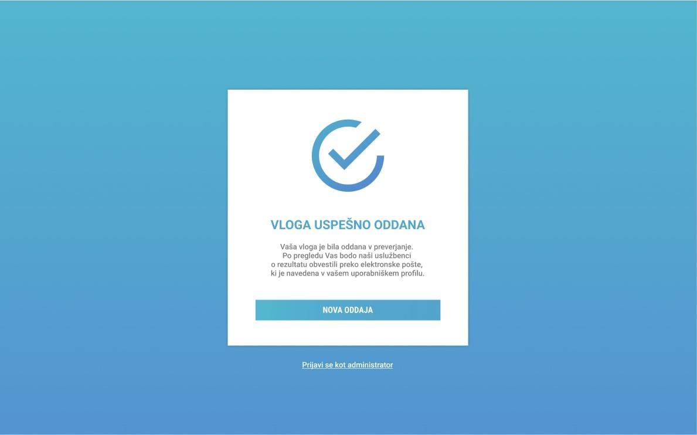
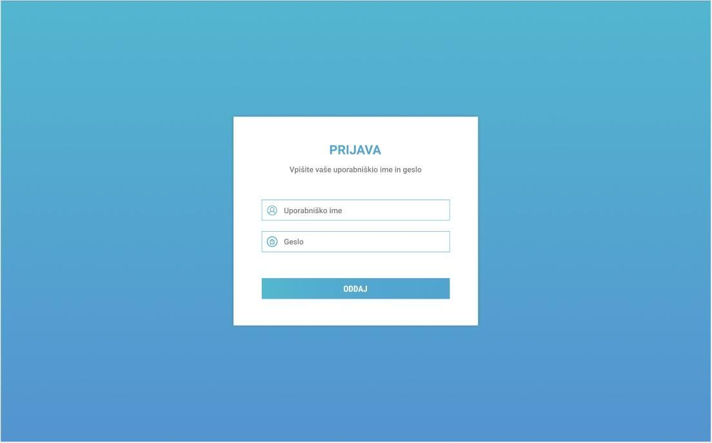
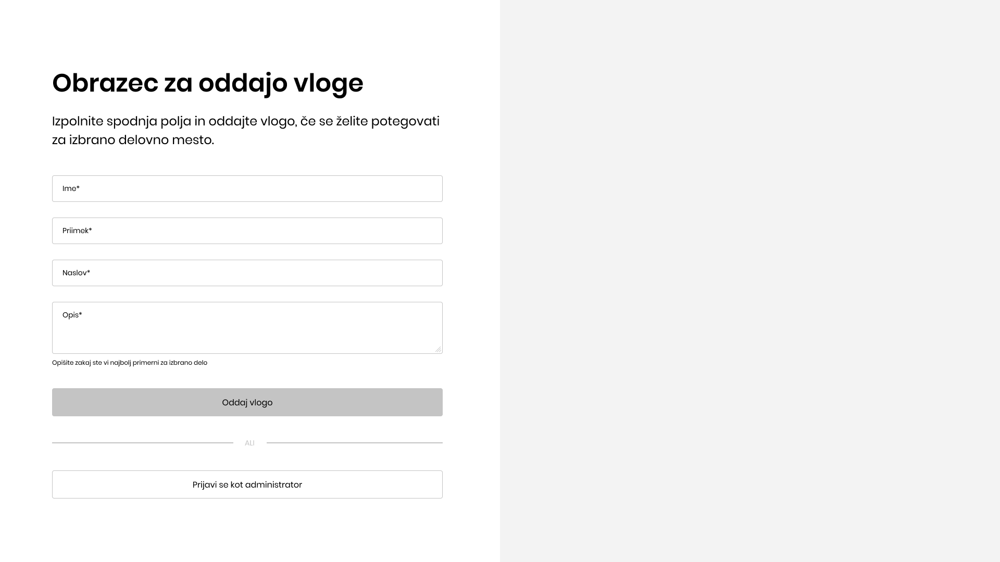
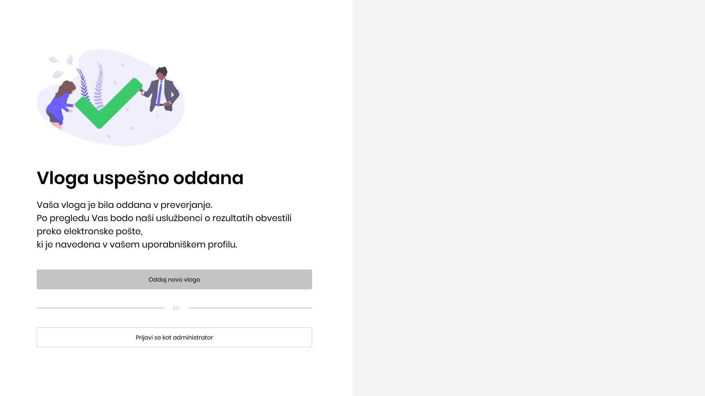
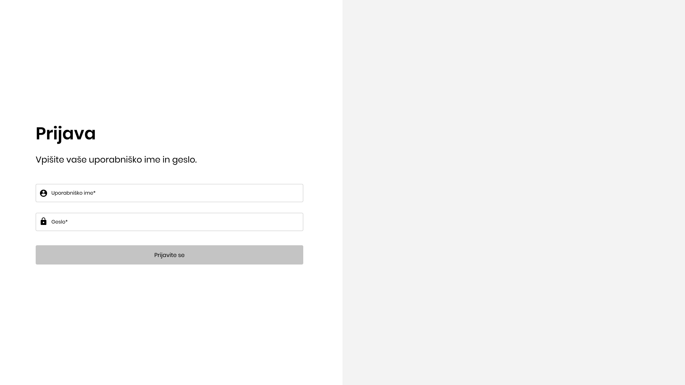
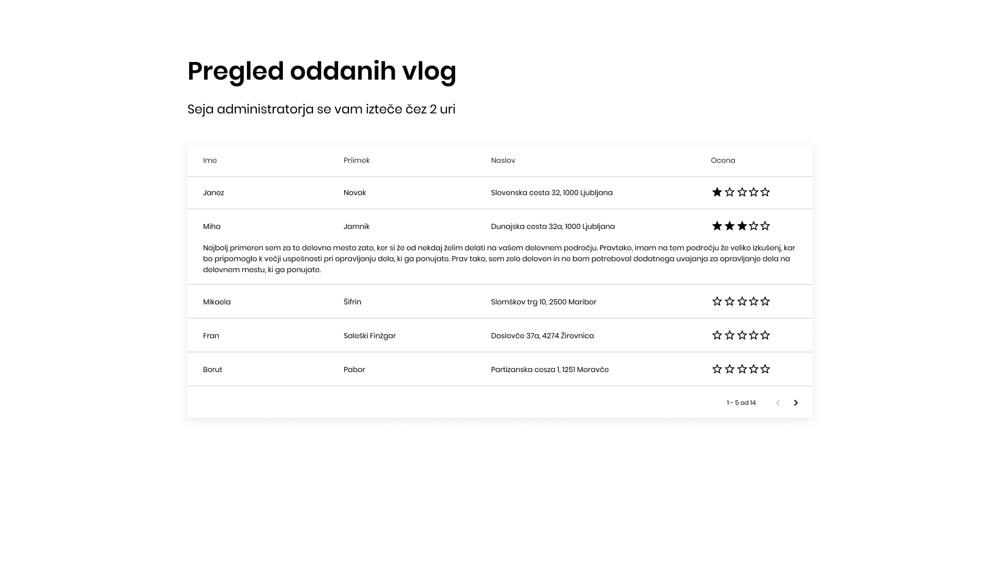
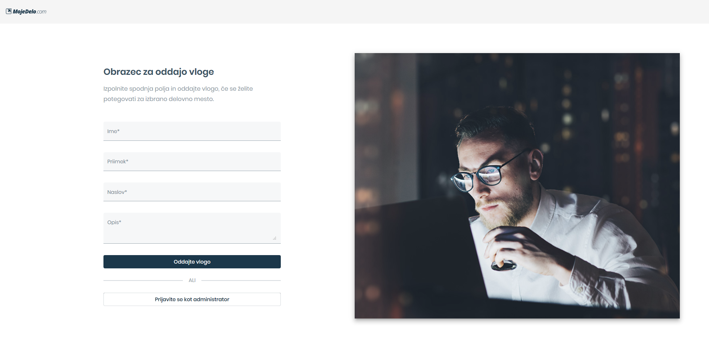
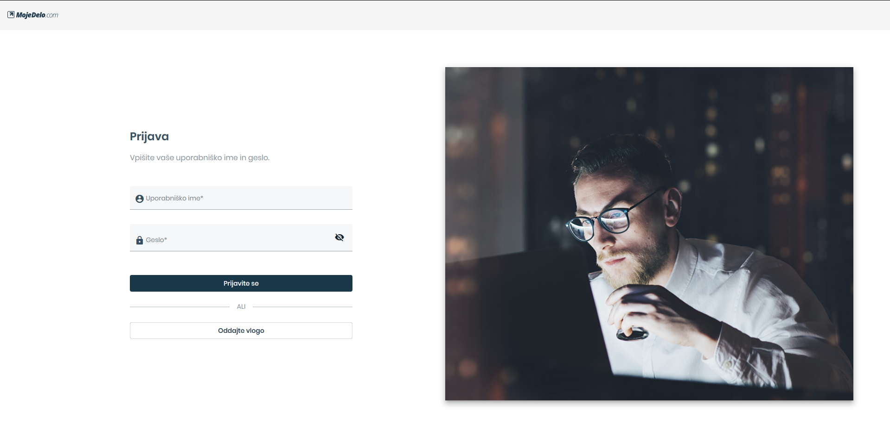
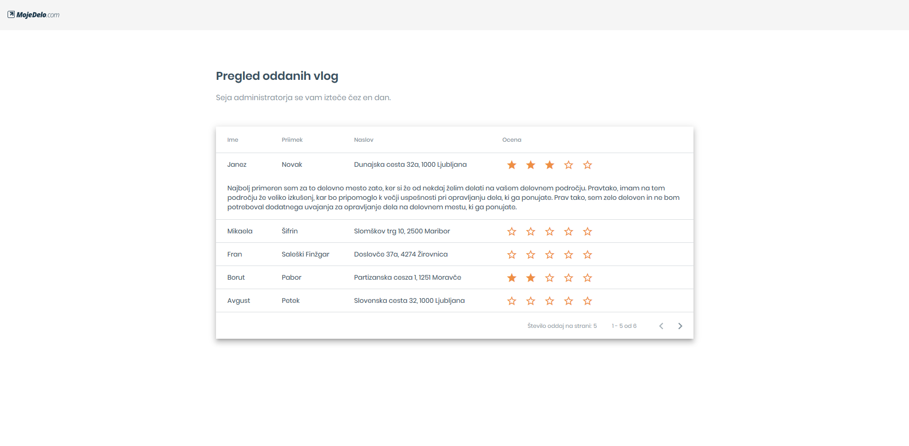

# Spletna aplikacija za oddajo in pregled vlog za delo - MojeDelo

> Aplikacija, ki za svoje delovanje uporablja lokalni pomnilnik

## Navodila

Ko odpremo spletno aplikacijo, se nam prikaže stran, na kateri se nahaja vloga za delo. Prototip strani lahko vidimo na sliki 1. Vlogo oddamo s klikom na gumb »oddaj«. Ker aplikacija deluje samo na odjemalcu, se vloga ne odda na strežnik, ampak se shrani v lokalni pomnilnik. Pred oddajo je potrebno preveriti, da nobeno izmed polj ni ostalo neizpolnjeno. V kolikor je katero izmed polj ostalo prazno, o tem obvestimo uporabnika, ter vloge ne shranimo v lokalni pomnilnik.

Če je vloga uspešno shranjena v pomnilnik, to sporočimo uporabniku tako, da mu prikažemo komponento za uspešno opravljeno oddajo vloge. Prototip komponente je viden na sliki 2. Ob kliku na gumb »nova oddaja« uporabniku ponovno prikažemo prvotno komponento vidno na sliki 1.

Kot lahko vidimo na prototipu strani za oddajo vloge, se pod obrazcem nahaja tudi povezava z besedilom: »prijavi se kot administrator«. V kolikor uporabnik klikne to povezavo preverimo, če ima v lokalnem pomnilniku nastavljeno spremenljivko jeAdmin na resnično. Če je spremenljivka ustrezno nastavljena ga preusmerimo na pot /admin, ki vsebuje pregled vlog; če spremenljivke ni v pomnilniku, ga preusmerimo na pot /login, kjer se nahaja obrazec za vpis. Prototip vpisnega obrazca lahko vidimo na sliki 3. Naloga poteka samo na odjemalcu, kar pomeni, da nimamo strežnika za avtentikacijo uporabnikov, ter se ob prijavi preveri samo, da vpisna polja niso prazna. Če je katero izmed polj ostalo prazno, o tem obvestimo uporabnika, prijava pa je neuspešna. V kolikor so polja zapolnjena, v lokalnem pomnilniku nastavimo spremenljivko jeAdmin na resnično, uporabnika pa preusmerimo na pot /admin. Administratorja je potrebno 24 ur po prijavi avtomatsko odjaviti, tako da se mora za ponovno uporabno strani znova prijaviti.

Ko smo preusmerjeni na pot /admin vidimo komponento »pregled vlog«, katere prototip je prikazan na sliki 4. Administratorju se prikažejo vse vloge, ki so shranjene v lokalnem pomnilniku. Administrator lahko te vloge oceni z oceno od 1 do 5, s pomočjo zvezdic, kot je vidno na prototipu. Oceno je potrebno shraniti tudi v lokalni pomnilnik, da je ob naslednjem obisku strani še vedno vidna. Če je bilo oddanih več kot pet vlog, na strani dodamo tudi paginacijo, da se nam ne prikažejo vse vloge za delo naenkrat. V kolikor še ni bila oddana nobena vloga, namesto vlog administratorju prikažemo sporočilo, da še ni bila oddana nobena vloga.

Slika 1                        |  Slika 2
:-----------------------------:|:-----------------------------:
  |  

Slika 3                        |  Slika 4
:-----------------------------:|:-----------------------------:
  |  

## Rešitev

### Prototip

Da bi rešitev čimbolj izstopala, sem v Figmi ponovno načrtal prototipe, ki kljub svoji abstraksnosti še vedno izražajo stil, ki sem ga hotel.
Zaslon sem razdelil na polovici, saj se tako bolj poenoti s trenutno implementacijo spletne strani MojeDelo. Spodaj so prikazane slike sprememb.

Oddaja vloge                                   |  Vloga uspešno oddana
:---------------------------------------------:|:-----------------------------------------------------:
  |  

Prijava                              |  Pregled prijav
:-----------------------------------:|:-------------------------------------------------:
  |  

Spremembe, ki sem jih naredil:
- Povezavi "Prijavite se kot administrator" sem za namene te aplikacije povečal pomembnost, tako, da sem jo spremenil v sekundarni gumb (t.j. gumb z obrobo).
- Na pregled vlog sem dodal indikator seje (koliko časa trenutna seja še velja za prijavljenega administratorja, preden se bo moral ponovno prijaviti).
- Če podrobno pogledamo tabelo, ta ne vsebuje stolpca "Opis", saj je ta skrit znotraj podaljšane vrstice. Povod za to spremembo je, da so opisi lahko zelo dolgi in jih ne želimo vrivati v tabelo, kar bi pokvarilo njen izgled.
- Kasneje dodana še orodna vrstica, ki poenostavi navigiranje med stranmi.

### Implementacija

Aplikacija je razvita v ogrodju Angular in sledi principom odzivnosti spletnih strani. Implementirana je tako, da kar se da dobro izrablja vse lasnosti ogrodja Angular:
- Komponentizacija (oddaja vlog, uspešna oddaja vlog, prijava, ocene, pregled vlog).
- Vmesna programska oprema, ki služi kot stražar dostopa do povezave `/admin`.
- Ponudnik, ki spremeni delovanje (v tem primeru izpisa) besedila paginacije.
- Model (vloga), ki doprinese z lažjemu razvoju in organiziranosti kode.
- Stili s temo narejeno po meri portala MojeDelo.
- Orodja za delom s časom in lokalnim pomnilnikom.
- Dinamično spreminjanje naslovov strani.
- Delovanje brez povezave.
- Možnost shranitve aplikacije na namizje.

Poleg zgonjih funkcionalnosti sem dodal še:
- Vse potrebne značke in sličice za optimizacijo iskalnikov (angl. Search Engine Optimization).
- Sliko Open Graph, ki na splošno poskbri, da vsebina še bolj izstopi.
- Dokumentacijo kode.
- Obarvanje orodnje vrstice brskalnika v primarno barvo.

Končni izgled je prikazan na spodnjih slikah.

Končni izgled - oddaja vloge                                                |  Končni izgled - vloga uspešno oddana
:--------------------------------------------------------------------------:|:---------------------------------------------------------------------------------:
  |  

Končni izgled - prijava                                            |  Končni izgled - Pregled prijav
:-----------------------------------------------------------------:|:-------------------------------------------------------------------------------:
  |  

## Testiranje

Za testiranje aplikacije lahko obiščete stran https://mojedelo.netlify.com/ ali zaženete aplikacijo lokalno.

### Lokalno testiranje

Predpogoj lokalnega zagona aplikacije je, da imate naloženo ogrodje [Node.js](https://nodejs.org/en/) ter [Angular CLI](https://cli.angular.io/).

Znotraj mape, kjer se nahaja dokument `README.md`, v vmesniku ukazne vrstice zaženete ukaz

```
npm install
```

ter počakate da se vam naložijo vse odvisnosti projekta.

Za testni strežnik nato poženete še ukaz `ng serve` in v brskalniku obiščete `http://localhost:4200/`.

## Postavitev

Za produkcijsko postavitev aplikacije poženete ukaz `ng build --prod`. Po postavitve se bodo vsi artifakti aplikacije najahaji v mapi `dist/`.

## Avtorske pravice

Uporabljene slike in ikone so last podjetja [MojeDelo.com](https://www.mojedelo.com/).