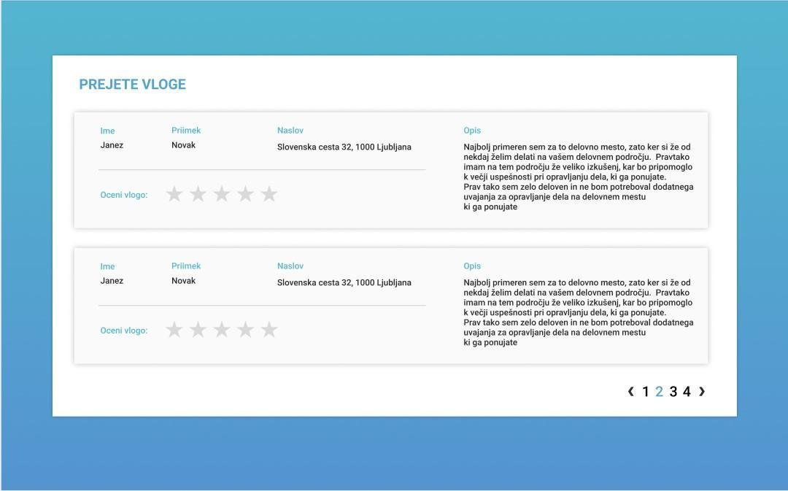

# MojeDelo Virtual Hackathon Submission


[](https://opensource.org/licenses/MIT)

Progressive Web Application for submission and review of job applications.
The application is written in an Angular framework and uses local storage for all of its operations.


## Instructions

When we open the application we are presented with the job form submission screen. The prototype of the page can be seen in figure 1. The form gets submitted after the user clicks on the "Submit" button. Because the application's operations are only executed on the client-side its data gets stored in the local storage. Before submitting the fields need to be validated. If any fields are left blank, you must notify the user and cancel the saving operation.

If the job application is successfully saved, we show the user another component that tells the user just that. The prototype of that component is visible in figure 2. Clicking on the "New submission" button takes the user back to the first screen.

There is also a link below the form "Sign in as administrator". If clicked you must check if the variable "isAdmin" in the local storage is set to `true`. If so, you redirect the user to the admin page which contains the list of all submissions. Otherwise, you must redirect the user to the login page. The prototype for the login page can be seen in figure 3. Since there is no authentication server involved, you must only check if all of the fields are set. If the fields are filled, set the variable "isAdmin" to true and redirect the user to the admin page. The admin needs to be automatically logged out 24 hours after logging in.

When the user is redirected to the admin page, he sees all of the submitted job applications. The prototype can be seen in figure 4. The administrator can rate these submissions from 1 to 5. You must also store the ratings in the local storage, so they can be seen on the next visit. Pagination must appear if there are more then five submissions in the table. If no application has been submitted yet a proper message must be presented to the administrator.

Figure 1                        |  Figure 2
:------------------------------:|:------------------------------:
  |  

Figure 3                        |  Figure 4
:------------------------------:|:------------------------------:
  |  

## Solution

### Prototype

To make the solution to stand out as much as possible, I re-designed the prototypes in Figma, which, despite their abstractness, still express the style I was going for. I've split the screen in half, to make it more in line with the current implementation of the MojeDelo website. Below are the figures for the changes.

Form submission                                   |  Form successfuly submitted
:------------------------------------------------:|:-----------------------------------------------------------:
  |  

Login                              |  Form overview
:---------------------------------:|:-------------------------------------------------:
  |  

These are the changes I end up doing
- I increased the importance of the "Log in as Administrator" link fo the purposes of this application by turning it into a secondary button (i.e. a border button).
- I added a session indicator to the admin page. It tells the logged-in administrator how long the current session is still valid before having to log in again.
- I removed the table column "Description" to make the table feel less cluttered and move it inside an expandable row.
- I added the toolbar afterward to simplify the page navigation.

### Implementation

The application is developed with the Angular framework and follows the principles of website responsiveness. I tried to show as many properties as possible in the implementation which are
- Componentization (application submission form, successful submission, login, admin, and favorites components).
- Middleware that serves as a guard on the `/admin` path.
- A provider that changes the output text of table pagination.
- A model that helps with code organization and faster development.
- Custom styles tailor-made for MojeDelo.
- Utilities for working with time and local storage.
- Dynamic changing of title on pages.
- Offline accessibility.
- Ability to save the application to one's home screen.

In addition to the above functionalities, I've also added
- All the necessary search engine optimization tags and icons.
- An Open graph image for maximum exposure.
- Code documentation.
- Theme color, which is responsible for coloring the phone's toolbar to the primary application color.

The final solution can be seen in the figures below.

Form submission                                                 |  Form successfuly submitted
:--------------------------------------------------------------:|:--------------------------------------------------------------------------------:
  |  

Login                                              |  Form overview
:-------------------------------------------------:|:---------------------------------------------------------------:
    |  

## Testing

To test the application, you can visit https://mojedelo.netlify.com/ or run the application locally.

### Local testing

The prerequisite for running the application locally is that you have [Node.js](https://nodejs.org/en/) and [Angular CLI](https://cli.angular.io/) installed. 

Within the folder where the document `README.md` is located, run the following command in your console.

```
npm install
```

Wait for all the project dependencies to install.

After that, run `ng serve` and navigate to `http://localhost:4200/` in your browser.

## Production

Run `ng build --prod` for a production build. Once built, all of the application artifacts will be located in the `dist/` folder.

## Copyright

The images and icons used in the project are the property of [MojeDelo.com](https://www.mojedelo.com/).
